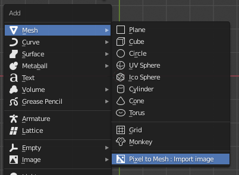
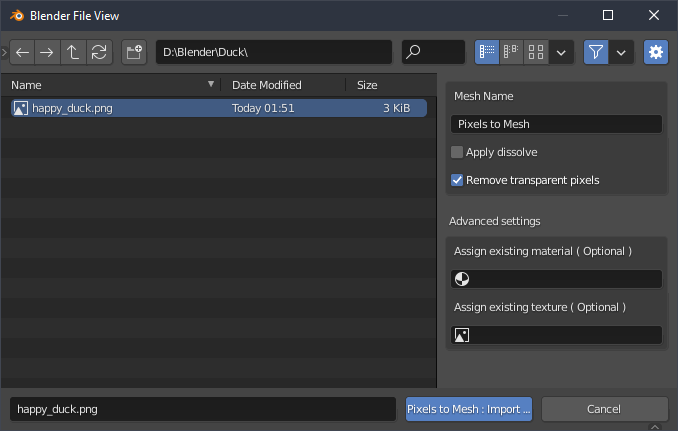
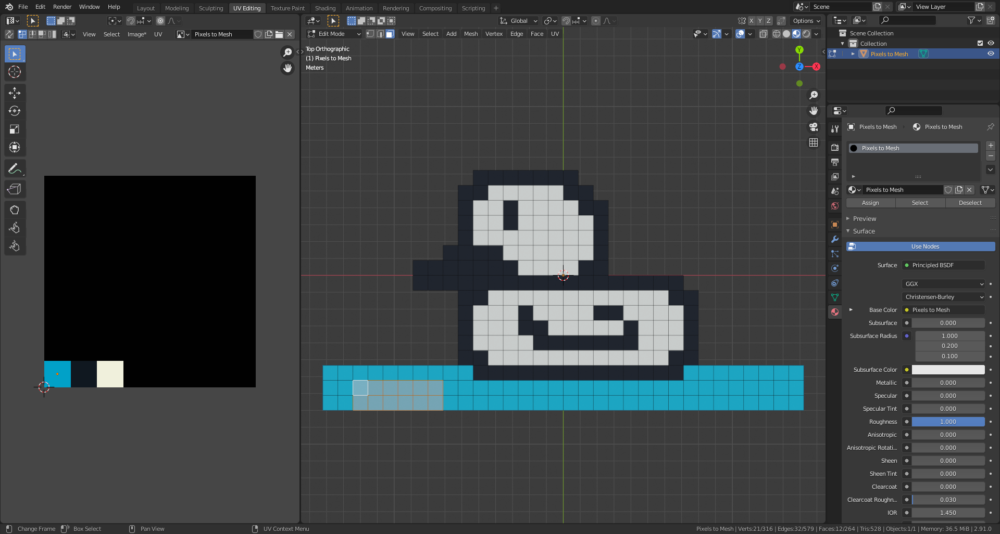

<h1 align="center"></h1>
<h1 align="center">Pixels to Mesh</h1>

Pixels to Mesh is a Blender addon that add the possibility of importing images ( pixels arts ) as subdivided and textured mesh.

 

## Installation

- Download the zip archive of this repository ( on Github : green button -> Download ZIP )
- Open Blender ( version 2.8 or higher )
- Go to Edit -> Preferences -> Add-ons -> Install button ( top right ) -> Select zip archive
- Pixels to Mesh will appear in the addon list, check the box to activate it

 

## How to use it

When the addon is installed a new menu option **Mesh -> Pixels to Mesh : Import image** will appear in the Add Mesh panel ( Shift + A ).

 

 

 

When opened you will be able to select the image you want to import, some additional options will be available on the right panel.

> **Warning** : be careful to not import images with high resolution, the generated plane will be subdivided based on the amount of pixels presents in the given image, each pixel will correspond to one square on the plane.

 

 

 

By default a texture and a material will be generated and applied to the mesh.

The texture will be a power of two squared image containing all colors found on the imported image ( the color palette ), all UVS are automatically set on the mesh to match this texture.

The material will not have anything special except the reference to the generated texture.

 

 

 
